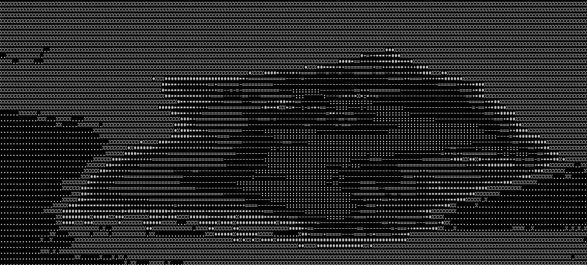
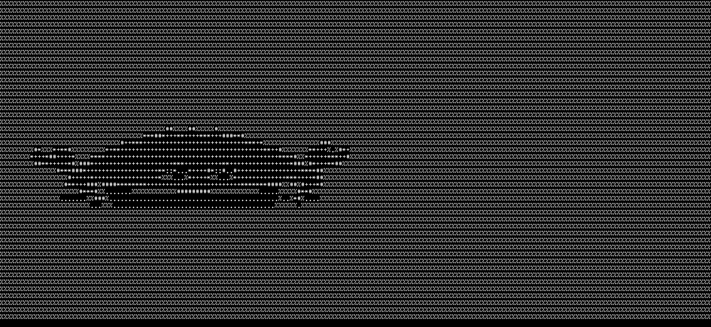

# govertor 

<p align="center">
  A powerful Go-based tool that converts images and videos into beautiful ASCII art
</p>

<p align="center">
  
</p>


## Features

- **Image to ASCII**: Convert PNG, JPG, and other image formats to ASCII art
- **Video to ASCII**: Transform videos into ASCII animations (GIF output)
- **High Quality Output**: Maintains visual clarity while converting to text
- **Multiple Format Support**: Works with various input formats
- **Batch Processing**: Convert multiple files efficiently

## Installation

```bash
go install github.com/asaft29/govertor/cmd/govertor@latest
```

Or clone and build from source:

```bash
git clone https://github.com/asaft29/govertor.git

cd govertor

make build
```

## Usage

The program automatically detects whether the input is an image or a video based on its file extension.

---

### Using Go

#### Convert a Single File

```bash
./govertor -i assets/ferris.png -s
# Converts an image and saves it

./govertor -i assets/ferris.mp4 -f 100 -s
# Captures the first 100 frames of a video, converts to ASCII, and saves it
```

#### Notes

* **Frames (`-f`)**:
  Default is **50 frames** for videos if not set.

* **Output path (`-o`)**:
  If not provided, outputs are automatically saved to:

  * `converted/images/` for images
  * `converted/videos/` for videos
    Only occurs if the **save flag (`-s`)** is set.

* **Save flag (`-s`)**:
  Enables saving the ASCII output. Without this, the ASCII art is printed to the terminal.

---

### Using Docker

Run `govertor` without installing Go or dependencies locally. Below is an example that runs the docker container:

```bash
docker build -t govertor .

docker run --rm -it govertor -i assets/videos/cartman.gif -f 100
```

This captures the first 100 frames of the video and prints the ASCII conversion to the terminal.


## Examples

### Image Conversions

| Original | ASCII Version |
|----------|---------------|
|  |  |
|  |  |
|  |  |

### Video Conversions

<p align="center">
  For further details you can take a look at the <a href="converted/">converted</a> folder
</p>


<p align="center">
  <br>
  <em>Rotating object, pretty cool :)</em>
</p>

<p align="center">
  <br>
  <em>Title screen of <strong>Doom</strong></em>
</p>

<p align="center">
  <br>
  <em>The beloved Rust mascot, <strong>Ferris</strong> the crab</em>
</p>

<p align="center">
  <br>
  <em>Zagreus, son of <strong>Hades</strong></em>
</p>

<p align="center">
  <br>
  <em><strong>Kratos</strong> unleashing his fury</em>
</p>


## Command Line Options

### Global Flags
- `-h, --help`: Show help information

### Commands
```
-f int
      Frames for video (default 50)

-i string
      Path to input file (image or video)

-o string
      Output of saved file

-s    Flag for saving
```

### ⚠️ IMPORTANT (Video Saving) ⚠️
When converting **videos**, you **must press `q` to quit** playback in order for the output to be saved.  
If you exit with **`Ctrl+C`**, the video **will not be saved**.

## Technical Details

### Supported Input Formats
- **Images**: PNG, JPG, JPEG, BMP, WEBP, ICO
- **Videos**: GIF, MP4, AVI, MOV, SVG, MKV, FLV, WEBM

### Output Formats
- **Images**: PNG with ASCII art overlay
- **Videos**: Animated GIF
